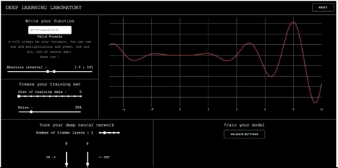
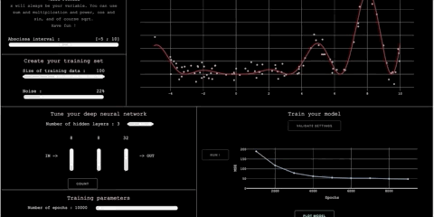

# Deep Learning Laboratory

How does a neural network fit a cosines or a square function ? If this question keeps you away from sleep, you are at the right place.
This application offers the opportunity to experiment simple deep neural network architectures. This can be used in an educational way. 

## Details

The implementation has been done using python with the Dash library for the display and the Pytorch library for the neural networks. 

You can choose a 1-dimension function to fit. You can generate training data choosing the size and the noise. You can tune your network by choosing up to 5 layers that can contain up to 256 neurons. You can choose the number of epochs for the training.

## Example

Here are pictures to illustrate an example.

  **1/2**
  
  **2/2**
  

